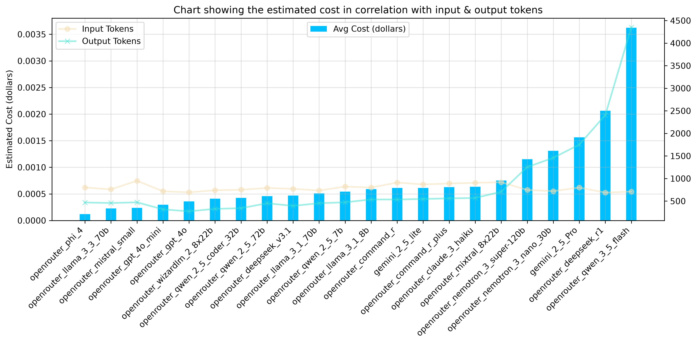
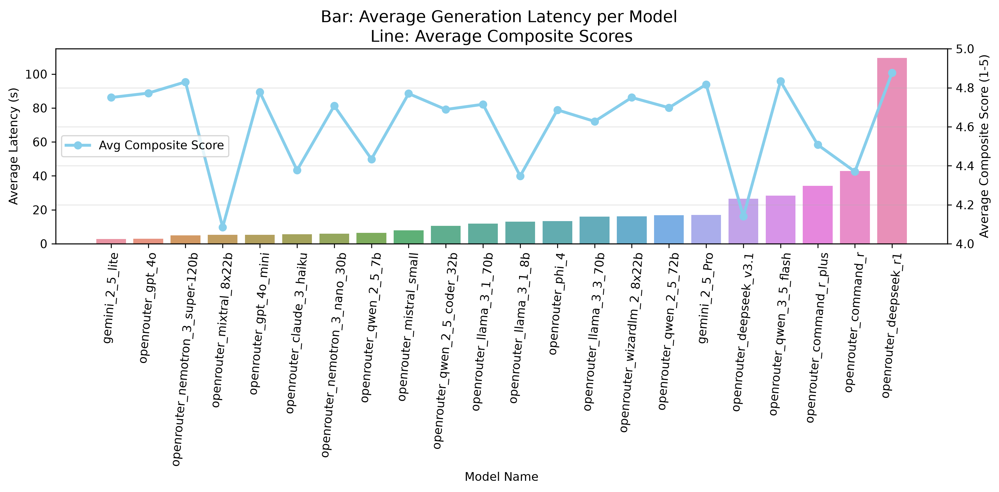

# [Linked In GenAI(Click to see the Website)](https://www.linkedingenai.com)

> [!NOTE]
> **Proprietary Notice**: The complete source code, prompt engineering pipelines, and internal business logic for this project are maintained in a private repository to protect intellectual property. This repository provides the public system architecture, workflow specifications, and empirical benchmark evaluation results.

## Authors

| **Phong Nguyen (Alex)** | **Huy Phan (Hertzy)** |
|:---|:---|
| **AI Engineering & Database** | **Web Developing & Database** |
| Built backend, state machine, multi-provider LLM client (OpenAI, Hugging Face, OpenRouter), prompt engineering pipeline, evaluation harness, FastAPI backend, Supabase auth/DB, Stripe credit billing, and AI evaluation. | Built responsive SPA frontend using HTML5, CSS3, and Vanilla JavaScript (ES6+), integrated client-side document export (docx.js), and designed core relational database schemas in Supabase. |
| GitHub: [@AlexDaPiggie](https://github.com/AlexDaPiggie) LinkedIn: [Hoai Phong Nguyen](https://www.linkedin.com/in/hoai-phong-nguyen-9367a4384/) | GitHub: [@hertzy-da-poet](https://github.com/hertzy-da-poet) Portfolio: [Huy Phan Portfolio](https://hertzy-da-poet.github.io/Hugo-Portfolio/) |

---

## About
- An end-to-end GenAI web-app to generate LinkedIn-ready Job Description Forms from user's descriptions. 
- Better than most free-tier AI models, our app guarantees the output with professional LinkedIn Layout, with user-friendly interface, and very detailed output.
- Different from other apps on the market which just generate, [linked-in-gen-ai](https://www.linkedingenai.com) goes even further, allowing users to refine their output as much as they want withotu losing any information. 
- The App supports EXPORT Word file or COPY & PASTE straight to LinkedIn
- Granting 30 free credits to every new user, and could be purchased more with only 1$/30 credits, we aspire to faciliate HR's as much as possible.

---

## Primary Features

- **Simple Guiding Questions**: Provide simple questions for users to describe their form (e.g. company's name, length, tone,...). 

- **Auto-fill questions from JD**: Upload Job Description file and the website uses **google/gemini-2.5-flash-lite** to fill in the answers automatically.

- **Guarantee LinkedIn Format**: Model outputs clean JSON matching Pydantic schema in `JobDescriptionDraft`, guaranteeing the ouptut to always follow LinkedIn format, minimize hallucination.

- **Markdown Format**: From JSON draft, this feature converst the messy JSON data into well-formatted Markdown file with headers & bullet points.

- **Refine requests**: After receiving the draft of the Job Description Form, users can type their feedbacks of how the draft should be improved.

- **Prevent mismatch between different versions**: In case users change their answers after having generated a draft, the web app will blocks `refine` feature until user clicks `generate` to generate a new draft again. 

- **User Login/Signup & Payment**: Create FastAPI endpoints for Supabase login, and Stripe credits payment plan to purchase new credits (1$/30 credits).

---

## Architecture Pipeline

  

1. **Intake (`JobAgent + SessionState`)**: Collects required info (title, company, duties, skills) and optional info (salary, benefits, tone, length).
2. **Draft Generation (`build_generation_prompt`)**: Prompts LLM to expand short notes into professional job description while forbidding fake facts.
3. **Parsing & Validation (`parse_json_markdown`)**: Cleans markdown code fences, parses JSON, validates against `JobDescriptionDraft`.
4. **Markdown Rendering (`MarkdownRenderer`)**: Formats sections into `# Title`, `## About the Role`, `## Responsibilities`, `## Requirements`, `## Benefits`.
5. **Refinement (`build_refinement_prompt`)**: Takes existing JSON draft + user edit request -> Returns updated full JSON draft.
6. **Billing & Auth Check**: Deducts 1 credit in Supabase before running LLM. Blocks if out of credits or rate-limited.

---

## Model Evaluation & Benchmarking

The project features an automated benchmarking suite and evaluation analysis testing models across structured scenarios.

### 1. Token Usage & Cost Efficiency

Measures the trade-off between input/output token consumption and cost per generation.

  

* **Most Cost-Effective**: `phi4`, `llama-3.3-70b`, `mistral-small`, and `gpt-4o-mini` achieved the lowest cost profile while maintaining concise output length.
* **Token Efficiency**: Models like `gpt-4o-mini` generated structured drafts without token hike, keeping API latency and expenses minimal.

### 2. Generation Latency

Measures end-to-end response time (seconds) across all test scenarios.

  

* Fast models like `gemini-2.5-flash-lite` and `gpt-4o-mini` can generate a draft in less that 2 seconds, which is highly suitable for this project.
* Larger open-weight models showed much higher latency depending on endpoint hosting infrastructure.

---

## Model Sequencing & Fallback Architecture

Based on benchmark results, an automated model sequence and fallback cascade was established:

* **Primary Model: google/gemini-2.5-flash-lite**
  * Chosen for its top overall performance: latency < 2s, 100% test-case pass rate, and high LinkedIn readiness scores with low token costs.
* **Fallback Options**:
  * openai/gpt-4o-mini
  * mistralai/mistral-small-24b-instruct-2501
  * meta-llama/llama-3.1-70b-instruct

---

## Tech Stack & Infrastructure

- **Backend Framework**: FastAPI (Python 3.11+)
- **LLM Orchestration**: Unified multi-provider adapter (OpenAI, Hugging Face, OpenRouter)
- **Validation & Parsing**: Pydantic v2 schemas + JSON markdown fence extractor
- **Authentication & Database**: Supabase (Auth + PostgreSQL database)
- **Payments & Billing**: Stripe API credit system
- **Frontend Client**: Vanilla JavaScript (ES6+), HTML5, CSS3 SPA with `docx.js` export
